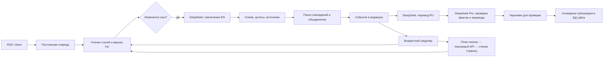

# Backend Crimap

Реализация: Node.js 24, SQLite WAL, один worker systemd. Дополнительный Redis, отдельная векторная БД и платная модель на каждую загрузку не нужны для начального потока Будапешта.

## Обнаружение и чтение

Каталог содержит 33 источника. Реально подключаемые RSS перечислены в `feeds` каждой записи; по умолчанию BRFK, OKF и Kékvillogó. Официальные ленты проверяются раз в 5 минут, СМИ — раз в 10. За проход берётся до 5 последних элементов (конфигурация FEED_MAX_ITEMS). Это ограничение нагрузки, а не гарантия полного исторического архива. Для первоначальной загрузки можно увеличить лимит.

HTML-чтение отделено от обнаружения URL. Generic RSS/Atom + HTML reader работает для доступных страниц без выполнения JavaScript. Источники с авторизацией, динамическими API, Telegram/Facebook не считаются подключёнными только потому, что присутствуют в каталоге: нужен официальный API/разрешённый адаптер или ручной ввод доступной публикации. Запрещённые robots.txt страницы не обходятся.

При старте также ставятся в очередь официальные источники уже опубликованных карточек. Совпадение прочитанного URL, места и даты сохраняет их публичные id/slug; новые черновики не заменяют опубликованные данные до проверки.

Reader проверяет robots.txt, ограничивает размер, время ответа и частоту по хосту, использует ETag/Last-Modified. Повторный неизменившийся документ не отправляется модели. Переадресации повторно проверяются; локальные и служебные IP закрыты, DNS-адрес закреплён на запрос. Нет выполнения команд/скриптов из публикаций. Ошибки доступа сохраняются, не превращаются в пустой успешный результат.

## Источники и доверие

`source-catalog.json` — редакционно заданный реестр с происхождением и приоритетом подключения. `official` назначается известному официальному домену, `media` — СМИ, community/telegram — неофициальным публикациям. Приоритет — порядок подключения, не статистический рейтинг правдивости. Проценты достоверности не выдумываются.

Для будущего численного рейтинга нужны измеренные исправления, доля подтверждённых фактов, задержка публикации и происхождение первоисточника. Сейчас сохраняются доказательства и атрибуция. Домен служит предварительной группой независимости, но не доказывает независимость редакций; автоматическое голосование источников и повышение corroborated по числу перепечаток не реализованы.

## Объединение

1. Одинаковые URL и хэш документа обрабатываются идемпотентно.
2. Кандидат на объединение находится по номеру дела либо совпадению типа, улицы и близкого времени происшествия.
3. Один кандидат проверяется моделью по обеим версиям и прочитанным документам. Неоднозначные кандидаты остаются отдельными черновиками с причиной проверки.
4. Изменение создаёт новую редакцию. Старые оригиналы, цитаты и наблюдения сохраняются. Обновление не меняет опубликованную карточку до проверки.

Это консервативное сопоставление, не универсальное распознавание всех дублей. Разные написания улицы, неизвестная дата, разные типы одного события могут потребовать редакционного объединения. Нельзя отождествлять людей только по возрасту и полу. На стартовом объёме кандидаты сравниваются в памяти; после роста — индексированные временные/географические кандидаты, затем отдельный worker pool.

## Расписание событий

| Возраст | Интервал |
|---|---|
| 0–2 часа | 10 минут |
| 2–4 часа | 15 минут |
| 4–12 часов | 30 минут |
| 12–24 часа | 1 час |
| 1–3 дня | 6 часов |
| 3–14 дней, включая после недели | 1 день |
| 14–30 дней | 2 дня |
| 30–90 дней | 1 неделя |
| 90–365 дней | 30 дней |
| от 365 дней | периодические проверки прекращаются |

Месяц/3 месяца/год — фиксированные 30/90/365 дней. Нижняя граница включена. Возраст — от occurredAt, при неизвестном времени от firstSeenAt. Новая публикация не омолаживает событие. Первая проверка сразу; следующая — от успешного окончания текущей с учётом нового возрастного интервала. После простоя одна актуальная проверка, без очереди пропущенных тиков. Поздняя статья может обновить старое событие, не возобновляя периодический опрос после года.

Задание имеет lease на 15 минут и heartbeat каждую минуту. Истёкшее владение восстанавливается после перезапуска; старый worker не может завершить новое владение. Ошибки дают экспоненциальную задержку до 6 часов, Retry-After учитывается до суток. Частичный сбой не записывается как успешная полная проверка. При отсутствии поискового ключа фиксируется researchAvailable=false: работают известные страницы и ленты, расширенного поиска нет.

## Где вызывается модель и сколько это стоит

| Этап | Модель по умолчанию | Когда вызывается |
|---|---|---|
| Извлечение | deepseek-flash, thinking disabled | Новый/изменённый документ |
| Сопоставление | deepseek-flash | Есть один кандидат на объединение |
| План дополнительных запросов | deepseek-flash | Наступила проверка и настроен поиск |
| Перевод EN→RU | deepseek-flash | Новая редакция; одинаковый текст кешируется |
| Проверка EN, RU и фактов | deepseek-v4-pro | После перевода каждой новой редакции |

Модель выбирается настройкой; по просьбе владельца Pro выполняет отдельную проверку каждой подготовленной редакции. Качество перевода проверяется на фактическом материале проекта; обещаний превосходства без корпуса оценок нет. Проверка языка — эвристический барьер, не полноценный лингвистический аудит. Структура, цитаты, даты и числовые значения валидируются программно. При ошибке формата — один исправляющий запрос, затем отложенная ошибка.

Кеш включает модель, инструкцию и вход. Суточный лимит по умолчанию $0.50 UTC; это выбранный предохранитель стартового запуска, меняется переменной. Расход резервируется до запроса, не исчезает после сбоя или перезапуска. Журнал хранит токены и консервативную оценку по пиковому тарифу, а не выставленный счёт. На 26.09.2026 для Flash: $0.30/млн входных и $1.20/млн выходных; Pro: $1.32 и $3.96. Кеш и непиковые часы дешевле. Тарифы конфигурации нужно пересматривать по [официальной странице DeepSeek](https://api-docs.deepseek.com/quick_start/pricing/).

Нельзя заранее обещать точную месячную сумму: она зависит от числа статей, редакций и поисковых запросов. Поисковые запросы имеют отдельный лимит (50/сутки), максимум 2 запроса и 6 прочитанных результатов за перепроверку.

## Поисковый посредник

Выбран Brave Web Search API: модель формирует JSON с узкими венгерскими запросами, сервер вызывает поиск, фильтрует известные домены и читает страницы обычным reader. Это отдельный поисковый индекс, не Google. Ключ BRAVE_SEARCH_API_KEY пока отсутствует. При желании именно Google нужен второй адаптер к разрешённому Google-провайдеру; скрейпинг страницы Google не используется.

Названия search_web/read_page описывают операции посредника. Реализация использует ограниченный JSON-план, а не неограниченный агентский цикл native function calling. Так проще ограничить расходы и число внешних запросов. Сниппет поиска не считается доказательством: требуется прочитанная страница и точная цитата. Документация: [DeepSeek JSON output](https://api-docs.deepseek.com/guides/json_mode/), [tool calls](https://api-docs.deepseek.com/guides/tool_calls/), [Brave Web Search](https://api-dashboard.search.brave.com/api-reference/web/search/get).

## Публикация и границы стартового запуска

Сбор, повторные проверки, версии и переводы автоматические. Публикация выполняется после редакционной проверки через CLI; это текущий режим запуска, а не обещание полностью автономной новостной редакции. Проверяющий подтверждает место, дату, смысл цитат, участников. Контекст и правовые блоки имеют отдельные флаги одобрения. Существующие публичные карточки не меняются от сырого ответа модели.

Автогеокодирование и публичная админ-панель не включены: координаты можно исправить в экспортированной редакции с фиксацией имени проверяющего. Неизвестные поля остаются пустыми. Три стартовых правовых сопоставления перенесены из ранее проверенных материалов проекта; новые составы добавляются в справочник после проверки действующей редакции закона.

Две SQLite-БД: collector.sqlite — приватные оригиналы/очередь/редакции/расходы; incidents.sqlite — публичная проекция существующего сайта. Публикация в публичной БД атомарна и идемпотентна по slug; отметка публикации в collector — отдельная транзакция, повтор после сбоя безопасен. Регулярно сохранять обе БД через SQLite backup, а не копировать активный файл без WAL.
