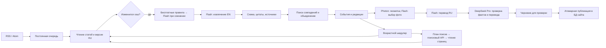

# Действующий порядок с 27 сентября 2026

1. Бесплатный парсер RSS/HTML и правила релевантности, затем короткая проверка Flash для неясных случаев. Пропавшие люди временно вне тематики; обычный пожар автомобиля недостаточен сам по себе.
2. Flash создаёт краткую идентичность события с цитатами. Бесплатный подбор кандидатов: дата происшествия (до 36 часов), место/район или точные близкие координаты. Категория не блокирует сравнение. Flash выбирает новое событие, повтор без дополнений или обновление. Повтор завершается здесь.
3. Полное извлечение Flash, объединение поддержанных фактов и источников. Нападение и вызванная им задержка транспорта — одно событие. Участники, известные возраста, травмы, задержание, хронология и атрибуция должны попасть в карточку, без вымышленных данных.
4. Дополнительные источники через настроенный поисковый провайдер (до двух запросов, до трёх результатов); затем фотографии и геокодер. Без ключа поиска используются уже прочитанные источники. Pro может уточнить ориентир во время финальной проверки, но не придумывает координаты.
5. Pro проверяет полноту и корректность английской карточки по оригиналам. revise → исправление Flash → Pro, до двух автоматических исправлений. pass → переводы RU/EN/HU на Flash с проверкой структуры и чисел. Переводы не вызывают повторный Pro автоматически.
6. Редактор публикует конкретную версию одной кнопкой. Снятие публикации обратимо; бюджет регулируется в редакторе, уже зарезервированные расходы учитываются.

Дедупликация старой базы использует тот же Flash merge. Оригинальные записи не удаляются. Уже опубликованный ID/slug имеет приоритет; новые факты создают черновик обновления. Бюджет архива — $10, суточный лимит обычного сбора — прежний $0.50. Расписание проверок по возрасту события не изменено.

Ни подбор кандидатов, ни модель не дают математической гарантии отсутствия дублей. Неоднозначное совпадение остаётся отдельным событием; оно не объединяется по одной лишь близости места.

---

Ниже — исходные технические детали. При различии порядка стадий применяется порядок выше.

# Backend Crimap

Реализация: Node.js 24, SQLite WAL, один worker systemd. Дополнительный Redis, отдельная векторная БД и платная модель на каждую загрузку не нужны для начального потока Будапешта.

## Обнаружение и чтение

Каталог содержит 33 источника. Реально подключаемые RSS перечислены в `feeds` каждой записи; по умолчанию BRFK, OKF и Kékvillogó. Официальные ленты проверяются раз в 5 минут, СМИ — раз в 10. За проход берётся до 5 последних элементов (конфигурация FEED_MAX_ITEMS). Это ограничение нагрузки, а не гарантия полного исторического архива. Для первоначальной загрузки можно увеличить лимит.

HTML-чтение отделено от обнаружения URL. Generic RSS/Atom + HTML reader работает для доступных страниц без выполнения JavaScript. Источники с авторизацией, динамическими API, Telegram/Facebook не считаются подключёнными только потому, что присутствуют в каталоге: нужен официальный API/разрешённый адаптер или ручной ввод доступной публикации. Запрещённые robots.txt страницы не обходятся.

При старте также ставятся в очередь официальные источники уже опубликованных карточек. Совпадение прочитанного URL, места и даты сохраняет их публичные id/slug; новые черновики не заменяют опубликованные данные до проверки.

Reader проверяет robots.txt, ограничивает размер, время ответа и частоту по хосту, использует ETag/Last-Modified. Повторный неизменившийся документ не отправляется модели. Переадресации повторно проверяются; локальные и служебные IP закрыты, DNS-адрес закреплён на запрос. Нет выполнения команд/скриптов из публикаций. Ошибки доступа сохраняются, не превращаются в пустой успешный результат.

## Источники и доверие

`source-catalog.json` — редакционно заданный реестр с происхождением и приоритетом подключения. `official` назначается известному официальному домену, `media` — СМИ, community/telegram — неофициальным публикациям. Приоритет — порядок подключения, не статистический рейтинг правдивости. Проценты достоверности не выдумываются.

Для будущего численного рейтинга нужны измеренные исправления, доля подтверждённых фактов, задержка публикации и происхождение первоисточника. Сейчас сохраняются доказательства и атрибуция. Домен служит предварительной группой независимости, но не доказывает независимость редакций; автоматическое голосование источников и повышение corroborated по числу перепечаток не реализованы.

## Объединение

1. Одинаковые URL и хэш документа обрабатываются идемпотентно.
2. Кандидат на объединение находится по номеру дела либо совпадению типа, улицы и близкого времени происшествия.
3. Один кандидат проверяется моделью по обеим версиям и прочитанным документам. Неоднозначные кандидаты остаются отдельными черновиками с причиной проверки.
4. Изменение создаёт новую редакцию. Старые оригиналы, цитаты и наблюдения сохраняются. Обновление не меняет опубликованную карточку до проверки.

Это консервативное сопоставление, не универсальное распознавание всех дублей. Разные написания улицы, неизвестная дата, разные типы одного события могут потребовать редакционного объединения. Нельзя отождествлять людей только по возрасту и полу. На стартовом объёме кандидаты сравниваются в памяти; после роста — индексированные временные/географические кандидаты, затем отдельный worker pool.

## Расписание событий

| Возраст | Интервал |
|---|---|
| 0–2 часа | 10 минут |
| 2–4 часа | 15 минут |
| 4–12 часов | 30 минут |
| 12–24 часа | 1 час |
| 1–3 дня | 6 часов |
| 3–14 дней, включая после недели | 1 день |
| 14–30 дней | 2 дня |
| 30–90 дней | 1 неделя |
| 90–365 дней | 30 дней |
| от 365 дней | периодические проверки прекращаются |

Месяц/3 месяца/год — фиксированные 30/90/365 дней. Нижняя граница включена. Возраст — от occurredAt, при неизвестном времени от firstSeenAt. Новая публикация не омолаживает событие. Первая повторная проверка после возрастного интервала; следующая — от успешного окончания текущей с учётом нового возрастного интервала. После простоя одна актуальная проверка, без очереди пропущенных тиков. Поздняя статья может обновить старое событие, не возобновляя периодический опрос после года.

Задание имеет lease на 15 минут и heartbeat каждую минуту. Истёкшее владение восстанавливается после перезапуска; старый worker не может завершить новое владение. Ошибки дают экспоненциальную задержку до 6 часов, Retry-After учитывается до суток. Частичный сбой не записывается как успешная полная проверка. При отсутствии поискового ключа фиксируется researchAvailable=false: работают известные страницы и ленты, расширенного поиска нет.

## Где вызывается модель и сколько это стоит

| Этап | Модель по умолчанию | Когда вызывается |
|---|---|---|
| Извлечение | deepseek-flash, thinking disabled | Новый/изменённый документ |
| Сопоставление | deepseek-flash | Есть один кандидат на объединение |
| План дополнительных запросов | deepseek-flash | Наступила проверка и настроен поиск |
| Перевод EN→RU | deepseek-flash | Новая редакция; одинаковый текст кешируется |
| Проверка EN, RU и фактов | deepseek-v4-pro | После перевода каждой новой редакции |
| Неясная релевантность | deepseek-flash | Бесплатные правила не дали уверенного решения |
| Выбор фото | deepseek-flash | В прочитанном документе есть фотографии, а в карточке их нет |
| Исправления | deepseek-flash | Финальная проверка запросила правки; максимум две редакции исправления |

По просьбе владельца все рабочие этапы выполняет Flash. Pro выполняет только финальную проверку подготовленной редакции; вызов Pro для другого этапа запрещён программно. Эскалации сложного извлечения на Pro нет. Качество перевода проверяется на фактическом материале проекта; обещаний превосходства без корпуса оценок нет. Проверка языка — эвристический барьер, не полноценный лингвистический аудит. Структура, цитаты, даты и числовые значения валидируются программно. При ошибке формата — один исправляющий запрос, затем отложенная ошибка.

Кеш включает модель, инструкцию и вход. Суточный лимит по умолчанию $0.50 UTC; это выбранный предохранитель стартового запуска, меняется переменной. Расход резервируется до запроса, не исчезает после сбоя или перезапуска. Журнал хранит токены и консервативную оценку по пиковому тарифу, а не выставленный счёт. На 26.09.2026 для Flash: $0.30/млн входных и $1.20/млн выходных; Pro: $1.32 и $3.96. Кеш и непиковые часы дешевле. Тарифы конфигурации нужно пересматривать по [официальной странице DeepSeek](https://api-docs.deepseek.com/quick_start/pricing/).

Нельзя заранее обещать точную месячную сумму: она зависит от числа статей, редакций и поисковых запросов. Поисковые запросы имеют отдельный лимит (50/сутки), максимум 2 запроса и 6 прочитанных результатов за перепроверку.

## Поисковый посредник

Выбран Brave Web Search API: модель формирует JSON с узкими венгерскими запросами, сервер вызывает поиск, фильтрует известные домены и читает страницы обычным reader. Это отдельный поисковый индекс, не Google. Ключ BRAVE_SEARCH_API_KEY пока отсутствует. При желании именно Google нужен второй адаптер к разрешённому Google-провайдеру; скрейпинг страницы Google не используется.

Названия search_web/read_page описывают операции посредника. Реализация использует ограниченный JSON-план, а не неограниченный агентский цикл native function calling. Так проще ограничить расходы и число внешних запросов. Сниппет поиска не считается доказательством: требуется прочитанная страница и точная цитата. Документация: [DeepSeek JSON output](https://api-docs.deepseek.com/guides/json_mode/), [tool calls](https://api-docs.deepseek.com/guides/tool_calls/), [Brave Web Search](https://api-dashboard.search.brave.com/api-reference/web/search/get).

## Публикация и границы стартового запуска

Сбор, повторные проверки, версии и переводы автоматические. Публикация выполняется кнопкой в редакторе после финальной проверки Pro; до этого подготовка автоматическая. Одно подтверждение включает показанные контекст и правовые блоки, сохраняя пометки о неофициальных сведениях. CLI также доступен. Существующие публичные карточки не меняются от сырого ответа модели.

Защищённый редактор `/admin/` показывает черновики, сохранённые оригиналы, цитаты, замечания Pro и предложения новых полей. Правки создают новую редакцию и требуют новой проверки. Публикация проверяет номер версии и отпечаток перевода/проверки, блокируя гонку со сборщиком. Геометка определяется Photon по OpenStreetMap: проверяются границы Будапешта, район и улица, одинаковые названия не смешиваются. Для обновления того же адреса можно сохранить опубликованную метку. Неоднозначный адрес получает районную/городскую точность, а не выдуманный номер дома. Кеш и интервал 16 секунд ограничивают внешние запросы (80/сутки). Неизвестные поля остаются пустыми. Три стартовых правовых сопоставления перенесены из ранее проверенных материалов проекта; новые составы добавляются в справочник после проверки действующей редакции закона.

Две SQLite-БД: collector.sqlite — приватные оригиналы/очередь/редакции/расходы; incidents.sqlite — публичная проекция существующего сайта. Публикация в публичной БД атомарна и идемпотентна по slug; отметка публикации в collector — отдельная транзакция, повтор после сбоя безопасен. Регулярно сохранять обе БД через SQLite backup, а не копировать активный файл без WAL.

## Бесплатный отбор и исторический обход

`triage-signals.mjs` содержит тематические списки венгерских основ и выражений: насилие/ограбления, тяжёлые последствия, опасные ДТП, спасение/угроза и необычные обстоятельства. Диакритика, регистр и дефисы нормализуются; основы охватывают окончания. Зелёный флаг имеет приоритет над транспортными/рутинными словами. Он означает «не отбрасывать», а не доказанную тяжесть. Отрицания и неоднозначные последствия разбирает короткий Flash-запрос; отсутствие Будапешта в заголовке также не является самостоятельным основанием отказа.

На заголовке/сниппете отбрасываются только явно плановые служебные и транспортные сообщения без зелёных флагов. Для ДТП требуется полный текст с явным сообщением об отсутствии пострадавших или только лёгких последствиях, без остальных значимых признаков. Недостаточный текст или отсутствие слова «тяжёлый» направляются в Flash. Сохраняются причина и способ отбора. Хеши документов, URL и кеш ответов убирают повторную оплату неизменившихся материалов.

Историческое обнаружение использует пагинацию BRFK и WordPress REST Kékvillogó. Границы периода относятся к публикациям источников, не дате происшествия. Страницы, фактический диапазон дат, найденные/отсеянные URL и ошибки сохраняются. После бесплатного обнаружения очередь предпочитает завершить подготовку/перевод/проверку одной карточки перед новым извлечением.

Кампания хранит собственный совокупный бюджет; все её Flash/Pro-вызовы, включая исправления, учитываются по campaign_id, независимо от смены дня и перезапуска. Резерв перед запросом не позволяет выйти за потолок. При исчерпании её задания получают paused; регулярный сбор имеет отдельный дневной лимит. У архивных ошибок максимум три попытки задания.

Фото выбирает Flash только из фактически прочитанных URL и подписей, максимум три. Программа повторно проверяет источник и публичный сетевой адрес. Существующие публичные фотографии сохраняются. Новые внешние ссылки показываются с атрибуцией, rights=unknown не переименовывается в лицензию; link-only не встраивается. Визуальное распознавание, гарантированное наличие фото у любого события и глобальный поиск изображений не реализованы.

Автоподготовка и исправления создают новые редакции; любое изменение сбрасывает допуск к публикации. После двух неуспешных исправлений или недостаточных данных карточка остаётся черновиком с причиной, а не заполняется догадками.

## Geographic plausibility (2026-09-27)

Pro verifies approximate positions against the physical setting, including existing exact-labelled coordinates. Source anchors can request road, tram, rail, waterfront, building or area. For linear surfaces the server reads a bounded cached OpenStreetMap extract around a real geocoder result, projects candidate positions onto the mapped lines, and supplies their type, route references when available and OSM URLs to Pro. The model cannot invent numeric candidates. Junctions use actual shared road nodes; mapQuery can correct the spelling of the same source-named place, with final identity verification by Pro. Same-named subway stations and information boards no longer silently qualify as streets. All extra map requests share the geocoder rate and daily limits. There is no unrestricted route search: absent map evidence remains an explicit unresolved approximation, never a fabricated exact point. Public corrections still require editor publication.

### Completeness and live discovery (2026-09-27)

`details.mjs` runs Flash before preparation/Pro for participant-bearing, crime or casualty cards. Its schema limits updates to participants/context/legal with exact evidence. It caches a content/catalog/document fingerprint in preparation metadata and records why legal data is absent. Legal blocks require a suspect/convicted participant key. Catalog variants cover basic versus aggravated qualifications separately; unsupported variants create `legal.catalog.*` requests instead of invented penalties. The verified statute reference is NJT, 2012. évi C. törvény, version 2026-08-26 (checked 2026-09-27); sections 164, 239/B, 339 and 365. NJT lazily loads sections after 338; those provisions were checked through its own njtGetBlock endpoint, not inferred from a truncated HTML page.

`crimap-discovery.timer` invokes `cli.mjs discover` in a separate oneshot process. It claims ONLY feed jobs using normal SQLite leases. No model calls are made. Whole RSS feeds, durable item fingerprints, 48-hour initial lookback and broad free title/excerpt triage feed the existing article pipeline. Recurring source polling remains independent of the paid worker and its spending caps. Successful poll metadata is in source_polls; failures remain on feed jobs with retry/backoff. Existing worker and timer cannot execute the same feed lease concurrently.
