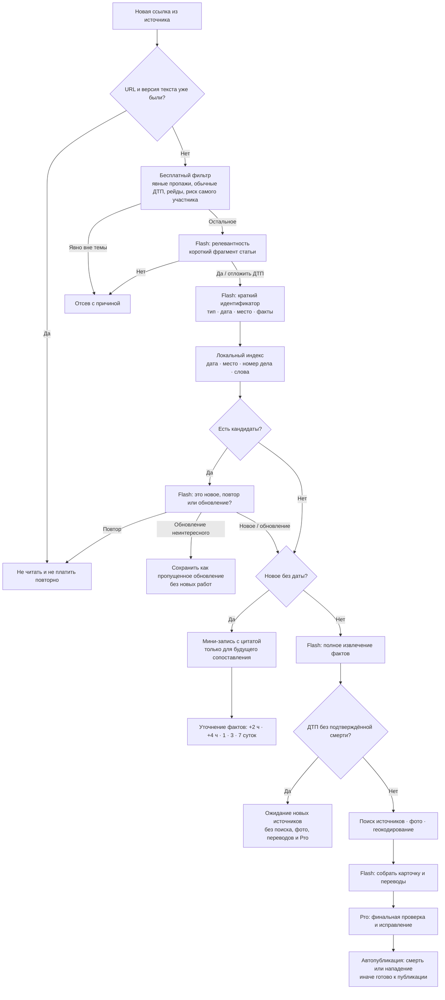

# Оптимизированный путь статьи

Этот документ описывает исполняемый путь в [pipeline.mjs](../../backend/pipeline.mjs), а не желаемую схему. Каждый прямоугольник `Flash` — отдельный короткий запрос; локальные шаги не используют модель.

## Почему это экономит запросы

1. Повтор URL и неизменившаяся версия прекращают путь до модели.
2. Бесплатные правила отбрасывают только однозначные случаи. Всё остальное получает один дешёвый Flash-ответ «подходит / не подходит», чтобы не потерять необычное происшествие.
3. Поиск дублей начинается с локального индекса. Flash сравнивает только короткий список кандидатов и только после дешёвого отбора.
4. Новое событие без даты сохраняется как короткая доказуемая запись. Известные источники уточняются через 2 и 4 часа, затем на 1-й, 3-й и 7-й день; после этого дорогие этапы не запускаются. Новая статья с датой всё равно найдёт запись через индекс и продолжит существующее событие.
5. Pro запускается только после релевантности, даты, проверки дубля, полного извлечения и подготовки карточки.

Ключевые исполняемые точки: [free rules and Flash triage](../../backend/triage.mjs), [identity and duplicate comparison](../../backend/dedup.mjs), [pipeline gates](../../backend/pipeline.mjs), [traffic fatality barrier](../../backend/traffic-policy.mjs), [the recheck policy](../../contracts/v2/recheck-policy.json).
