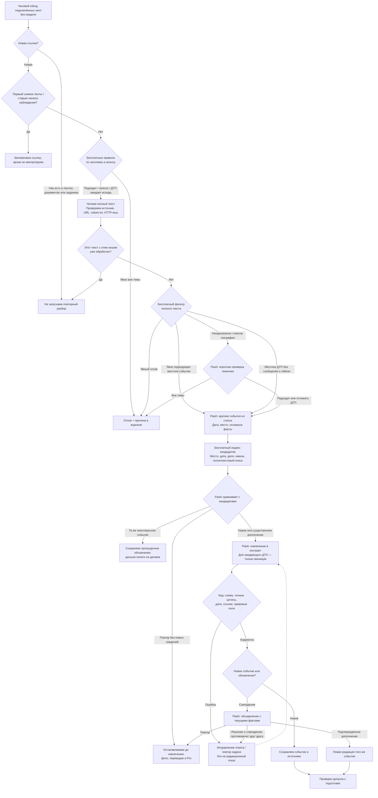
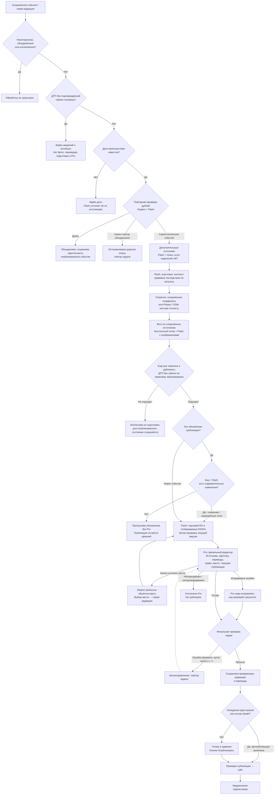
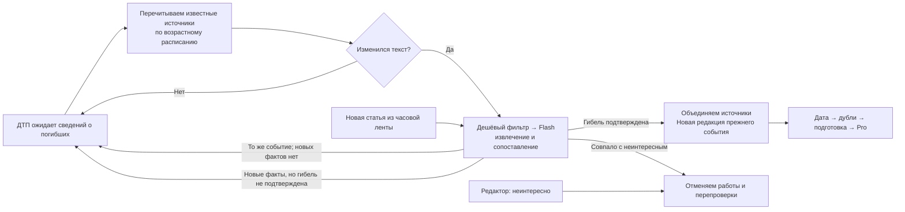
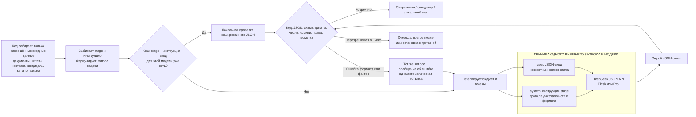

# Как событие доходит до публикации

Снимок реализации: 28 сентября 2026, с правилом `fatal-road-accidents-only-v1`. Это описание кода, не желаемой архитектуры. Внешние сервисы на схеме работают только при наличии соответствующей конфигурации. Архивный импорт — отдельная команда; часовой сбор не начинает его заново.

## 1. Новая статья → сохранённое событие

Основание: [discoverFeed](../../backend/discovery.mjs), [Reader](../../backend/network.mjs), [cheapDecision / Triage.check](../../backend/triage.mjs), [Pipeline.ingest / upsert](../../backend/pipeline.mjs), [indexedCandidates](../../backend/event-index.mjs), [identify / compareBrief / matchCandidates](../../backend/dedup.mjs), [validateEvidence](../../backend/contract.mjs).

## 2. Допуск → подготовка → Pro → публикация

Основание: [Store.enqueue / holdForFatality / holdForDate](../../backend/store.mjs), [Pipeline.gather / prepare / review / queueAutoPublication](../../backend/pipeline.mjs), [completeDetails](../../backend/details.mjs), [Preparation.enrich](../../backend/prepare.mjs), [reviewMedia](../../backend/media-quality.mjs), [comparePublicationUpdate](../../backend/update-comparison.mjs), [assembleFinal](../../backend/final-editor.mjs), [publish](../../backend/publish.mjs).

Фото опционально: отсутствие картинки не является запретом публикации. Pro вызывается после подготовки, но сама проверка может потребовать дополнительных обращений Pro для геометки или исправления переводов. «Pro только в конце» не означает «один запрос Pro на событие».

## 3. Что именно отсекается и что откладывается

| Случай | Где решается | Результат |
| --- | --- | --- |
| Повтор URL в ленте / старый материал при подключении источника | Бесплатно, `discoverFeed` | Не импортируется снова; есть запись о просмотренной ссылке |
| Неизменившийся уже обработанный документ | Бесплатно, `ingest`, хеш документа | Без повторных вызовов моделей |
| Плановые ограничения движения, расписания, служебные новости | Бесплатные правила; для неясного контекста Flash | Отсев |
| Пропавшие люди | Бесплатные правила и инструкции Flash | Отсев; похищение, убийство и нападение не считаются обычной пропажей |
| Нападение животного; промышленная химическая утечка | Однозначный заголовок — бесплатно; смешанная история — Flash | Вне тематики; отдельное человеческое нападение сохраняется |
| Наркотики, рейды, обыски, изъятия, контроль скорости | Flash по редакционной инструкции | Отсев, если нет отдельного подходящего происшествия |
| Коррупция, экономические дела, обычная кража имущества, добровольный экстремальный риск | Flash по редакционной инструкции | Отсев с оговорёнными исключениями для самостоятельного насилия / посторонних потерпевших |
| Обычное возгорание машины | Flash после бесплатного направления на проверку | Отсев при отсутствии значимых последствий / отдельного пожара, поджога и т. п. |
| ДТП: травмы, реанимация, неопределённый исход, только повреждённые машины | Бесплатные признаки / Flash → отдельный программный барьер | `awaiting-fatality`; минимальная запись и источники сохраняются, дорогие этапы запрещены |
| ДТП: гибель человека подтверждена | Признак `death` или погибший участник + цитата исхода; цитаты проверяются при извлечении | Может продолжать подготовку; другие проверки всё ещё обязательны |
| Нет даты у нового события | `identify` → `provisionalEvent` → `holdForDate` | Сохраняется короткая запись для поиска совпадений; пять коротких уточнений фактов, затем активный поиск прекращается; не запускаются извлечение, поиск, фото, геокодирование, перевод и Pro |
| То же событие без новых фактов | Flash `compare` / `merge` | Повтор не доходит до подготовки и Pro |
| Возможный дубль, но объединение не удалось | `deduplicateExisting` | Ошибка и повтор; дорогое продолжение заблокировано |
| Неинтересное событие и его новые публикации | Отметка редактора + Flash-сопоставление | Работы по событию отменяются, новые совпавшие материалы сохраняются как пропущенные обновления |
| Новая редакция эквивалентна опубликованной | Код + Flash `update-compare` | Pro пропускается, повторные источники продолжают проверяться |
| Нет фото / фото декоративное | Бесплатный фильтр + Flash `media-review` | Фото удаляется из кандидатов; само событие продолжает путь |
| Неизвестна правовая квалификация / нет подходящей статьи | Flash + каталог + проверка Pro | Обязательное объяснение покрытия, а не выдуманная санкция |
| Ошибка HTTP, ответа модели, цитаты, перевода, геосервиса | Код и очередь | Повтор / техническая остановка; это не «неинтересное» |
| Общий бюджет исчерпан | `reserveCost`, `runOne` | Пауза до увеличения бюджета; данные не отбрасываются |

Основание тематики: [бесплатные правила](../../backend/triage.mjs), [правила контекста](../../backend/editorial-scope.mjs), [инструкция редакционной тематики](../../backend/prompts/editorial-scope.md), [инструкция Flash](../../backend/prompts/triage.md). Слова в инструкции модели — не жёсткие программные запреты: модель может ошибаться. Для ДТП поэтому добавлен отдельный программный барьер [traffic-policy.mjs](../../backend/traffic-policy.mjs).

## 4. Возврат и повторные проверки

Известные источники ожидающего ДТП перечитываются без генерации поисковых запросов моделью. Новый текст может потребовать Flash; неизменившийся обработанный документ — нет. Фоновый возрастной опрос прекращается через 365 дней; новые публикации всё ещё могут сопоставляться с сохранённым событием. Отсев в ленте и отложенное ДТП — разные вещи: у просто отсеянной ссылки нет созданного события и его возрастного планировщика.

| Возраст опубликованного события | Интервал повторной проверки |
| --- | --- |
| До 3 часов | 15 минут |
| 3–24 часа | Раз в 4 часа, только с 10:00 до 22:00 по Будапешту |
| 1–3 суток | В 10:00 и 18:00 по Будапешту |
| 3–10 суток | Раз в день в 10:00 по Будапешту |
| 10–30 суток | Раз в 14 суток |
| 30–365 суток | Раз в 30 суток |
| От 365 суток | Периодический опрос прекращается |

Этот годовой график действует только для опубликованных карточек. Неопубликованная запись, ожидающая даты или подтверждения гибели, проверяет известные источники через 2 и 4 часа, затем на 1-й, 3-й и 7-й день от первого обнаружения. После пятой проверки активный поиск прекращается, но сохранённая запись остаётся в индексе: новая публикация всё равно может дополнить её позднее. Основание: [Pipeline.recheck](../../backend/pipeline.mjs), [scheduler](../../backend/scheduler.mjs), [машинное расписание](../../contracts/v2/recheck-policy.json).

## 5. Границы запросов к моделям

В больших схемах выше узел с подписью `Flash:` или `Pro:` означает не «локальный шаг», а отдельное обращение к модели. Его граница показана ниже: вопрос и ограниченный JSON-вход формируются кодом до внешнего вызова; сырой ответ никогда не переходит к следующему шагу без проверки. Попадание в кеш завершает путь до границы и не создаёт ни внешнего вызова, ни новых токенов.

`DeepSeek.json` строит эту границу в [model.mjs](../../backend/model.mjs): кеш и резерв располагаются снаружи, `POST /chat/completions` — внутри, а `validate(...)` выполняется только после получения ответа. Для Pro допустим только `stage=review`; Flash нельзя заменить Pro на извлечении, сопоставлении, переводе или отборе фото.

| Граница / модель | Вопрос, который задаётся внутри запроса | Вход до границы | Что должно пройти после ответа |
| --- | --- | --- | --- |
| Flash `triage` | «Соответствует ли материал редакционной теме; отложить ли ДТП?» | Заголовок, анонс или полный текст статьи | Решение `keep/defer`, причина и правила ДТП |
| Flash `identify`, `compare` | «Какое событие описано и является ли оно повтором кандидата?» | Краткие факты, дата, место, индексные кандидаты | Схема сопоставления; решение не объединяется без проверки |
| Flash `extract`, `merge` | «Извлеки / объедини подтверждённые факты в контракте» | Прочитанные статьи, точные цитаты, текущая карточка, каталог права | Контракт, доказательства, дата, ссылки и связи полей |
| Flash `research`, `details`, `resolve-date` | «Какие данные ещё можно подтвердить и какие запросы/дата обоснованы?» | Карточка и уже сохранённые источники | Максимум два поисковых запроса либо подтверждённые детали/дата |
| Flash `media`, `media-review` | «Какие изображения полезны для карточки?» | Только URL и подписи из прочитанных источников; для review — реальные изображения | Разрешённый список фото; фото остаётся необязательным |
| Flash `update-compare` | «Есть ли новые существенные сведения относительно опубликованной версии?» | Текущая публикация и новая редакция | Эквивалентный текст прекращает путь до переводов и Pro |
| Flash `translate`, `site-translate` | «Переведи перечисленные строки, сохранив числа и структуру» | Явный список строк и ключей | Покрытие всех ключей и защита чисел |
| Pro `review` | «Проверь и сама исправь финальную карточку и переводы» | Карточка, переводы, дословные абзацы и контекст источников, право, геометка, текущая публикация | Финальный контракт, все переводы, цитаты, право, место и сравнение с публикацией |

Один «шаг Pro» на основной схеме может содержать несколько таких границ: первая проверка, уточнение места по полученным реальным кандидатам или автоматическая коррекция ответа. После каждого ответа код снова собирает новый ограниченный вход и начинает следующую границу; модель не продолжает скрытый диалог и не вызывает внешние сервисы сама.

## 6. Точные границы реализации

- Поиск дублей — обычный SQLite FTS5 плюс сравнение Flash. Это не векторная база и не гарантия, что найден каждый дубль. Кандидаты выбираются по датам/местам/фактам; публикация проверяется повторно перед Pro.
- Бесплатный тематический фильтр не пытается понимать каждую статью. Явные случаи обрабатывает правилами, неоднозначные передаёт Flash. Для ДТП без погибших Flash всё ещё может понадобиться для краткой идентификации, сопоставления и сохранения минимального события; «отложено» не означает ноль токенов вообще.
- Черновой перевод выполняется **до** Pro. Pro получает подготовленную карточку, дословные выдержки источников (короткие документы целиком), переводы, каталог закона и уже опубликованную версию. Финальные исправленные переводы сохраняются с редакцией.
- `update-compare` пропускает только отсутствие изменений либо эквивалентные текстовые изменения с уверенностью Flash ≥0.95. Изменения структуры, чисел, участников, статусов, права, координат и фотографий защищены от такого пропуска.
- В [Search.query](../../backend/search.mjs) есть отдельный дневной предел поискового API (по умолчанию 50), независимо от общего бюджета моделей. В этой задаче он не менялся. Без `BRAVE_SEARCH_API_KEY` внешнего поиска нет; источники из лент и сохранённые статьи остаются доступны.
- Автоматическая публикация по коду включается для `type === 'assault'` или `signals.includes('death')`, если не выключена настройкой. Это не все серьёзные категории: например, `fight` без `death` автоматически не публикуется. Перед записью ещё проверяются дата, координаты, текущая проверка и переводы.
- Состояние «снято с сайта» скрывается фильтром админки, но `withdraw` само по себе не ставит «неинтересно» и не отменяет задания. Полная остановка — отдельная отметка «неинтересно». Это различие в действующем коде. Фильтры списка админки — представление данных, они не заменяют правила пайплайна.
- Текущие проверки Pro у отложенных ДТП показываются как история и не дают права публиковать. Прежние публичные карточки при применении нового правила автоматически не удаляются.

Проверки поведения: [traffic-policy.node-test.mjs](../../backend/test/traffic-policy.node-test.mjs), [dedup.node-test.mjs](../../backend/test/dedup.node-test.mjs), [date-resolution.node-test.mjs](../../backend/test/date-resolution.node-test.mjs), [update-comparison.node-test.mjs](../../backend/test/update-comparison.node-test.mjs).
